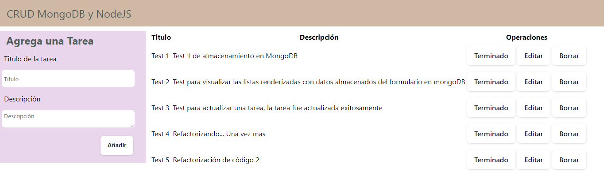
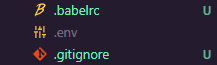
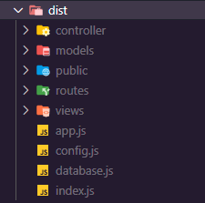
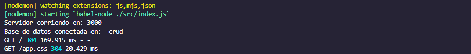

# Crud MongoDB y NodeJS

## Descripción
---
Este repositorio es un CRUD con MongoDB y NodeJs usando el Template Engine de Express (Handlebars).
- Se utilizo un compilador de JavaScript llamado Babel, que convierte codigo nuevo de ES6 a codigo legacy antes de ser ejecutado.

## Instrucciones
---
Si quieres ejecutar el proyecto debes seguir los siguientes pasos despues de clonar el repositorio.

- Crear un archivo .env y agregar la variable de entorno DB_URI y agregar la uri de tu base de datos con MongoDB

 

- Ejecutar el siguiente comando que creara una carpeta llamada "dist" que contendra el codigo legacy para produccion:

$ npm run production

 

- Ejecutar el siguiente comando, que ejecutara el proyecto:

$ npm run start

ó

$ node dist/index.js

- En caso de que quieras modificar el proyecto debes correrlo con el siguiente comando:

$ npm run test

Si el proyecto se ejecuta correctamente deberias ver el siguiente mensaje en la terminal.

